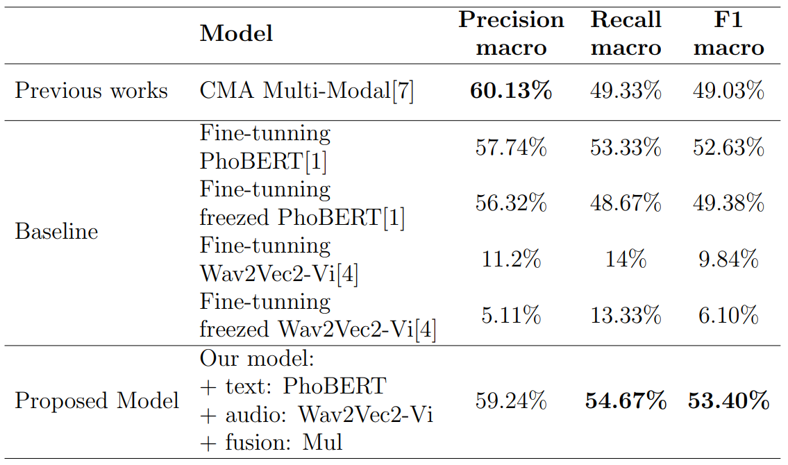

# MusicAuthors-Classification-Using-MultiModal

A research of using multi-modal for Vietnamese music authors classification task.

Also this is our graduation thesis at HCMUS. Graduation year: 2023.

To receive full dataset, notebooks please contact: <19120597@student.hcmus.edu.vn>

## Table of contents

1. [Dataset](#dataset)
    - [Data collecting system](#system)
    - [Dataset description](#data_description)
2. [Models' Description](#models)
3. [Research Result](#result)
4. [Training Notebooks](#notebooks)

##  Dataset

Our full data construction phase:

###  Data collecting system

Framework: Scrapy (version 2.8) \
Language: Python (version 3.9) \
Source code: [CSN Crawler](https://github.com/PhmNm/csn_music_crawler)

Collecting process:

###  Dataset description

Our dataset includes 15 Vietnamese authors and 50 songs each, except the last author. The train, validation and test set account for 60%, 20% and 20% of the full dataset respectively.

| author            | songs            |
|-------------------|-----------------:|
| châu đăng khoa    |               50 |
| khắc hưng         |               50 |
| khắc việt         |               50 |
| mr siro           |               50 |
| nguyên chấn phong |               50 |
| nguyễn hồng thuận |               50 |
| nguyễn văn chung  |               50 |
| nguyễn đình vũ    |               50 |
| phan mạnh quỳnh   |               50 |
| phúc trường       |               50 |
| phạm trưởng       |               50 |
| trịnh công sơn    |               50 |
| vương anh tú      |               50 |
| khánh đơn         |               50 |
| tiên cookie       |               46 |

**CSV columns definition**

| column | definition |
|---|---|
| author | the label of data |
| name | name of the song |
| lyric | song's lyric |
| audio_path | path to audio file |
| crawl_date | the date this line was added to csv |
| token_len | length of the tokens list after tokenized by AutoTokenizer |
| audio_len | song duration in seconds |

Contact for full access to our dataset.

##  Models' Descriptions

Propose Models:

Self-build from [Cross-Modal Attention MultiModal](https://arxiv.org/abs/2108.09669) of Krishna D N.

##  Research Result

Metrics score:

Confusion matrices:

##  Training Notebooks

Our implementing and training phase mostly on Google Colaboratory mechanism. Therefore, there was no specific version of local training setups for these models.

Contact for detailed notebooks.

In this repository, we provide 4 [notebooks](notebooks/) with 4 main phases:

- Load & visual datasets.
- Initalize Dataset class and Model class.
- Configure hyper-parameters, specific settings & Train model.
- Visualize the loss curves and metrics.

## License

    MIT License

    Copyright (c) 2023 PhmNm

    Permission is hereby granted, free of charge, to any person obtaining a copy
    of this software and associated documentation files (the "Software"), to deal
    in the Software without restriction, including without limitation the rights
    to use, copy, modify, merge, publish, distribute, sublicense, and/or sell
    copies of the Software, and to permit persons to whom the Software is
    furnished to do so, subject to the following conditions:

    The above copyright notice and this permission notice shall be included in all
    copies or substantial portions of the Software.

    THE SOFTWARE IS PROVIDED "AS IS", WITHOUT WARRANTY OF ANY KIND, EXPRESS OR
    IMPLIED, INCLUDING BUT NOT LIMITED TO THE WARRANTIES OF MERCHANTABILITY,
    FITNESS FOR A PARTICULAR PURPOSE AND NONINFRINGEMENT. IN NO EVENT SHALL THE
    AUTHORS OR COPYRIGHT HOLDERS BE LIABLE FOR ANY CLAIM, DAMAGES OR OTHER
    LIABILITY, WHETHER IN AN ACTION OF CONTRACT, TORT OR OTHERWISE, ARISING FROM,
    OUT OF OR IN CONNECTION WITH THE SOFTWARE OR THE USE OR OTHER DEALINGS IN THE
    SOFTWARE.
